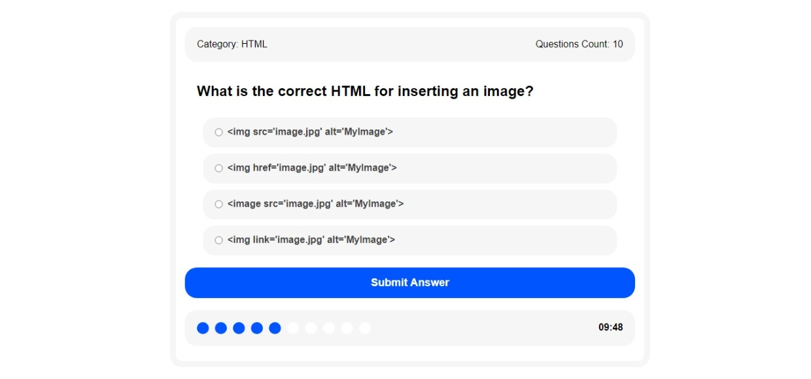
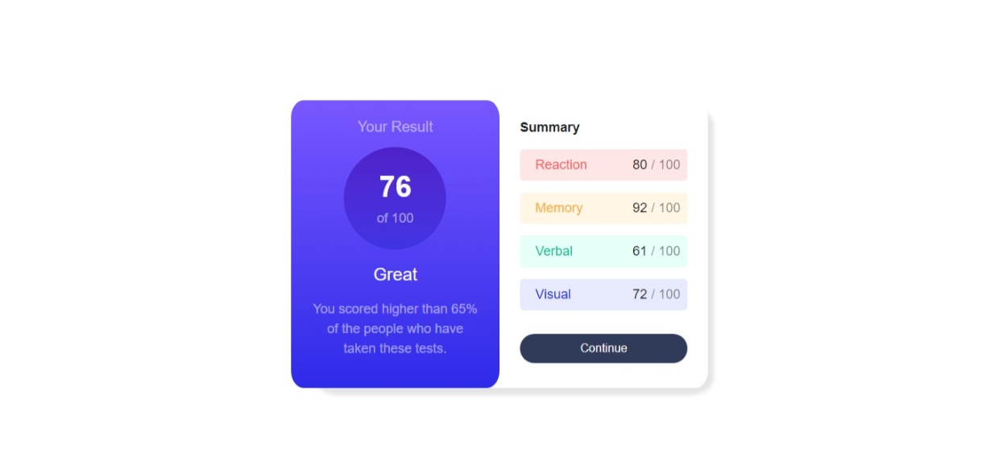
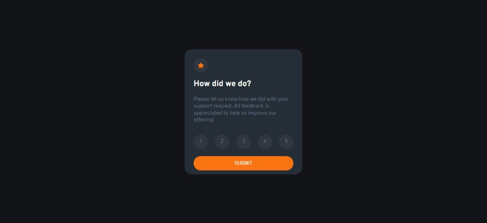
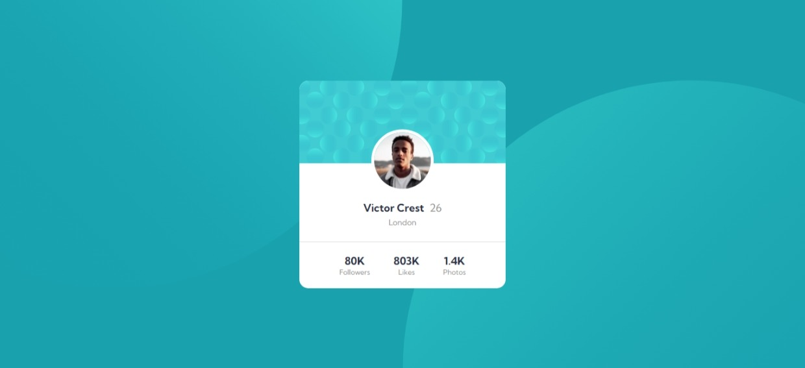
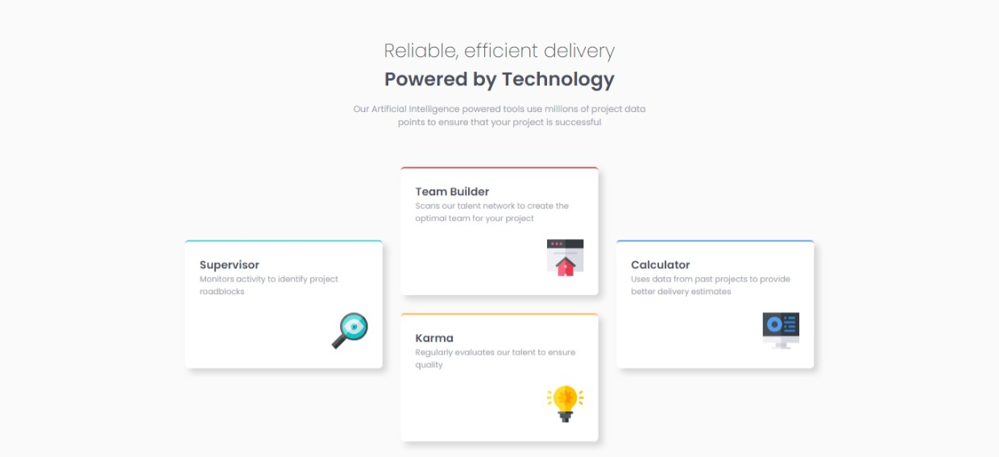

# Portfolio Task

Welcome to Mohamed Khalifa's portfolio Task! This repository showcases Mohamed Khalifa's skills and projects as a frontend web developer. Explore the various sections of this portfolio to learn more about Mohamed's work and contact information.

## Table of Contents
- [About Me](#about)
- [My Skills](#skills)
- [Services](#services)
- [Projects](#projects)
- [Contact](#contact)

## About Me 

I'm **Mohamed Khalifa**, a 21-year-old recent graduate in Computer and Information Technology from Egypt. I'm a passionate frontend web developer with expertise in crafting visually appealing and user-friendly websites. My skills encompass web development, UI/UX design, and responsive design. I'm proficient in HTML, CSS, JavaScript, and keep up with the latest front-end trends and technologies.

Thank you for visiting my portfolio. Feel free to explore my work, and if you have a project or want to discuss frontend development, I'd love to connect. Let's bring your digital vision to life!

## My Skills 

- HTML5
- CSS3
- JavaScript
- Bootstrap
- jQuery
- JSON
- Figma

## Services 

### Front End Development
I specialize in implementing the user interface of web applications, focusing on visual and interactive elements for an enhanced user experience.

### Responsive Web Design
I ensure that web applications adapt and display optimally on various screen sizes and devices, providing a seamless user experience.

### UI/UX Design
I create intuitive and visually appealing user interfaces while optimizing the overall user experience for websites and applications.

## Projects 

Explore my projects to see my skills in action:

1. **Quiz App**
   - [View Demo](https://mohamedkhalifa11.github.io/Quiz-App/)
   - [Source Code](https://github.com/MohamedKhalifa11/Quiz-App)

   

2. **Results Summary**
   - [View Demo](https://mohamedkhalifa11.github.io/Results-summary-component/)
   - [Source Code](https://github.com/MohamedKhalifa11/Results-summary-component)

   

3. **Interactive Rating**
   - [View Demo](https://mohamedkhalifa11.github.io/Interactive-rating-component/)
   - [Source Code](https://github.com/MohamedKhalifa11/Interactive-rating-component)

   

4. **Stats Preview Card**
   - [View Demo](https://mohamedkhalifa11.github.io/Stats-preview-card-component/)
   - [Source Code](https://github.com/MohamedKhalifa11/Stats-preview-card-component)

   

5. **Profile Card**
   - [View Demo](https://mohamedkhalifa11.github.io/Profile-card-component)
   - [Source Code](https://github.com/MohamedKhalifa11/Profile-card-component)

   

6. **Four Card Feature**
   - [View Demo](https://mohamedkhalifa11.github.io/Four-card-feature-section)
   - [Source Code](https://github.com/MohamedKhalifa11/Four-card-feature-section)

   

## Contact 

Get in touch with me:
- **Email:** [Send Email](https://formspree.io/f/xleynkjv)
- **WhatsApp:** [+201123482136](https://wa.me/+201123482136)

---

&copy; 2023 Mohamed Khalifa | All Rights Reserved.

